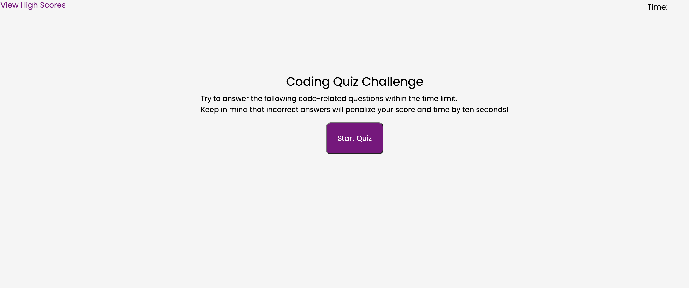

# Code Quiz

## Code Quiz Assignment

My task for this assignment was to a build a timed coding quiz with multiple-choice questions. The app will run in the browser and will feature dynamically updated HTML and CSS powered by JavaScript code that I wrote. It has a clean, polished, and responsive user interface. 

I utilized html, css, javascript and git to complete this homework assignment. 

You can view my GitHub and Live URL below:
### [GitHub Link](https://github.com/MystieBluz/coding-quiz) 
### [Live URL](https://mystiebluz.github.io/coding-quiz/)

##### Screenshot of coding quiz:

